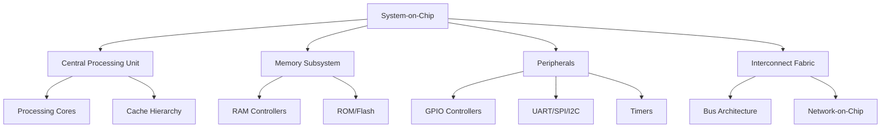
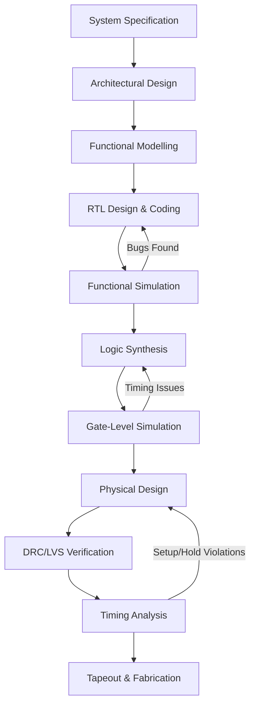
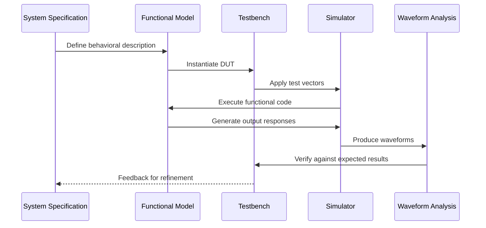
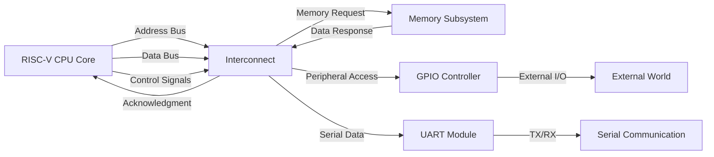

# 🧩 Week 2 — BabySoC Fundamentals & Functional Modelling

> "In the world of silicon, understanding the system before building the circuits is the key to success."

---

## 📋 Objective

This week's task focuses on building a solid foundation in System-on-Chip (SoC) design principles and practicing functional modelling techniques using industry-standard simulation tools. The goal is to understand the architectural components of an SoC and model the BabySoC design to verify its functional correctness before proceeding to RTL and physical design stages.

**Key Goals:**
- Understand the fundamental concepts of SoC architecture
- Identify and analyze the core components of a typical SoC
- Explore the BabySoC as a simplified learning model
- Perform functional modelling and simulation using Icarus Verilog and GTKWave

---

## 🧠 What is a System-on-Chip (SoC)?

A System-on-Chip is an integrated circuit that consolidates all essential components of a computer or electronic system onto a single chip. Unlike traditional systems where processors, memory, and peripherals exist as discrete components on a circuit board, an SoC integrates these elements into a unified silicon die, enabling:

- **Reduced Power Consumption** — Shorter interconnects and optimized communication
- **Smaller Form Factor** — Critical for mobile and embedded applications
- **Enhanced Performance** — Lower latency between components
- **Cost Efficiency** — Reduced manufacturing and assembly complexity

Modern SoCs power everything from smartphones and IoT devices to automotive systems and AI accelerators. They represent the convergence of digital design, analog circuits, memory architecture, and software integration.

---

## 🏗️ Core Components of a Typical SoC

### ⚙️ Central Processing Unit (CPU)

The CPU serves as the computational engine of the SoC, executing instructions and managing system operations. In BabySoC, we utilize a RISC-V based processor core, which offers:

- Open-source ISA (Instruction Set Architecture)
- Modular and extensible design
- Energy-efficient execution pipeline
- Simplified instruction set for learning

### 💾 Memory Subsystem

Memory components store data and instructions required for system operation. The memory hierarchy typically includes:

- **On-chip SRAM** — Fast, low-latency storage for active data
- **Cache Memory** — Reduces memory access latency
- **External Memory Interfaces** — Connects to off-chip DRAM or Flash

### 🔌 Peripherals

Peripherals enable the SoC to interact with the external world:

- **GPIO** — General-purpose input/output pins
- **UART/SPI/I2C** — Communication protocols
- **Timers/Counters** — Time-based operations
- **ADC/DAC** — Analog-to-digital conversion

### 🌐 Interconnect Fabric

The interconnect serves as the communication backbone, enabling data transfer between components:

- **Bus-based architectures** (AHB, AXI, Wishbone)
- **Network-on-Chip (NoC)** for complex systems
- **Arbitration and routing logic**

---

## 🎯 Why BabySoC? A Simplified Learning Model

BabySoC is designed as an educational platform to introduce learners to SoC design concepts without the overwhelming complexity of commercial-grade systems. It provides:

- **Manageable Complexity** — Focus on core concepts without extraneous features
- **Open-source Tools** — Accessible simulation and synthesis environments
- **Modular Architecture** — Clear separation of concerns
- **Hands-on Learning** — Practical experience with real design flows

BabySoC typically integrates:
- A simple RISC-V CPU core
- Basic memory interface
- Essential peripherals (UART, GPIO)
- Standard interconnect protocol

This simplified model serves as a stepping stone toward understanding industrial-scale SoC design while maintaining pedagogical clarity.

---

## 🔄 SoC Design Flow: From Concept to Silicon

---

## 🧪 Functional Modelling: The First Critical Step

Functional modelling occurs early in the design flow and serves to validate the system architecture before committing to RTL implementation. This stage involves:

### Why Functional Modelling Comes First

1. **Early Bug Detection** — Catch architectural flaws before expensive RTL coding
2. **Performance Estimation** — Analyze throughput, latency, and bandwidth requirements
3. **Interface Validation** — Verify communication protocols between modules
4. **Algorithm Verification** — Test computational correctness
5. **Documentation** — Creates a golden reference for RTL comparison

### Functional Modelling Process

### BabySoC Functional Model

The BabySoC functional model consists of:

- **CPU behavioral model** — Instruction fetch, decode, execute cycle
- **Memory model** — Read/write operations with realistic timing
- **Peripheral models** — I/O transaction simulation
- **Interconnect abstraction** — Data transfer mechanisms

---

## 🛠️ Tools Used

| Tool | Purpose | Role in Week 2 Task |
|------|---------|---------------------|
| **Icarus Verilog** | Open-source Verilog simulator | Compiles and executes Verilog testbenches for functional verification |
| **GTKWave** | Waveform viewer | Visualizes simulation results and debugs signal behavior |
| **RISC-V GNU Toolchain** | Compiler and assembler | Generates machine code for CPU testing |
| **Text Editor / IDE** | Code development | Writing Verilog modules and testbenches |

---

## 📡 BabySoC Signal Flow Architecture

### Signal Description

- **Address Bus** — Carries memory or peripheral addresses from CPU
- **Data Bus** — Bidirectional data transfer between components
- **Control Signals** — Read/write enable, chip select, interrupt requests
- **Handshaking Protocols** — Ready/valid signals for data synchronization

---

## 🎓 Key Learnings & Understanding

### Fundamental Insights

Through this week's study of SoC fundamentals and functional modelling, several critical concepts emerged:

**Hierarchical Design Philosophy**  
SoC design is inherently hierarchical. Each component (CPU, memory, peripherals) is designed independently with well-defined interfaces, then integrated through a standardized interconnect. This modularity enables parallel development and simplifies debugging.

**Abstraction Layers**  
The design process moves through multiple abstraction levels:
- System-level (functional behavior)
- RTL (register-transfer operations)
- Gate-level (logic cells)
- Physical (transistors and layout)

Each layer refines the previous while maintaining functional equivalence.

**Verification-First Mindset**  
Functional modelling emphasizes early verification. By creating behavioral models and comprehensive testbenches, designers can validate system correctness before investing weeks in RTL coding. This "shift-left" approach dramatically reduces project risk.

**Interface Standardization**  
Modern SoCs rely on standardized interfaces (AMBA, AXI, Wishbone) to ensure component reusability. Understanding these protocols is essential for creating interoperable IP blocks.

### BabySoC's Role in the Learning Journey

BabySoC serves as a practical vehicle for understanding:

- How individual components collaborate to form a complete system
- The importance of timing, synchronization, and data flow
- Trade-offs between performance, power, and area
- The iterative nature of hardware design and verification

This foundational knowledge prepares us for subsequent stages: RTL implementation, synthesis optimization, and physical design challenges.

---

## 🚀 Connection to Future Stages

The functional modelling work in Week 2 directly enables:

**Week 3 — RTL Design**  
The functional model serves as a specification for RTL coding. We translate behavioral descriptions into synthesizable hardware descriptions.

**Week 4 — Synthesis & Timing**  
The golden functional model provides the reference for gate-level verification, ensuring synthesis transformations preserve functionality.

**Week 5 — Physical Design**  
Understanding signal flow and component interaction informs floorplanning decisions and optimization strategies during place-and-route.

**Week 6 — Integration & Tapeout**  
Functional models assist in system-level integration testing and post-layout verification.

---

## 📌 Summary

This week established the foundational understanding necessary for SoC design:

- **SoC Architecture** — Integration of CPU, memory, peripherals, and interconnect on a single chip
- **Component Roles** — Each subsystem's purpose and interface requirements
- **Design Methodology** — Functional modelling precedes RTL to validate architecture early
- **Simulation Flow** — Using Icarus Verilog and GTKWave to verify behavioral correctness
- **BabySoC Context** — A pedagogical platform balancing realism and accessibility

The transition from concept to silicon is a multi-stage journey. Functional modelling represents the critical first step where ideas are validated, interfaces are defined, and system behavior is proven correct before committing to expensive implementation phases.

---

## 📂 Repository Information

**Project:** BabySoC Fundamentals & Functional Modelling  
**Author:** Ebinesh K  
**Course:** VSD SoC Journey  
**Week:** 2  
**Tools:** Icarus Verilog, GTKWave  
**Status:** ✅ Completed

---

> "From function to fabrication — every chip begins as an idea."  
> — *VSD SoC Learning Path*

---

## 🔗 References

- [VSD SoC Journey - Fundamentals of SoC Design](https://github.com/hemanthkumardm/SFAL-VSD-SoCJourney/tree/main/11.%20Fundamentals%20of%20SoC%20Design)
- RISC-V Instruction Set Manual
- AMBA Protocol Specifications
- IEEE Standard for Verilog Hardware Description Language

---

**Next Week:** RTL Design and Simulation → Translating functional behavior into synthesizable hardware descriptions.
