#  Week 2: Part 1 - BabySoC Fundamentals & Functional Modelling

> "In the world of silicon, understanding the system before building the circuits is the key to success."

---

## Table of Contents

- [Objective](#-objective)
- [What is a System-on-Chip (SoC)?](#-what-is-a-system-on-chip-soc)
- [Evolution of SoC Technology](#-evolution-of-soc-technology)
- [Core Components of a Typical SoC](#️-core-components-of-a-typical-soc)
- [SoC Architecture Deep Dive](#-soc-architecture-deep-dive)
- [Understanding BabySoC](#-understanding-babysoc)
- [SoC Design Flow](#-soc-design-flow-from-concept-to-silicon)
- [Functional Modelling](#-functional-modelling-the-first-critical-step)
- [Simulation and Verification](#-simulation-and-verification-workflow)
- [Tools and Environment](#️-tools-and-environment)
- [BabySoC Implementation Details](#-babysoc-implementation-details)
- [Key Learnings](#-key-learnings--understanding)
- [Summary](#-summary)
- [Learning Resourses](#-learning-resources)

---

## Objective

This week's task focuses on building a solid foundation in System-on-Chip (SoC) design principles and practicing functional modelling techniques using industry-standard simulation tools. The goal is to understand the architectural components of an SoC and model the BabySoC design to verify its functional correctness before proceeding to RTL and physical design stages.

**Key Goals:**
- Understand the fundamental concepts of SoC architecture
- Identify and analyze the core components of a typical SoC
- Explore the BabySoC as a simplified learning model
- Perform functional modelling and simulation using Icarus Verilog and GTKWave
- Learn the importance of early verification in the design flow
- Understand signal flow and data communication between modules

---

## 🧠 What is a System-on-Chip (SoC)?

A System-on-Chip is an integrated circuit that consolidates all essential components of a computer or electronic system onto a single chip. Unlike traditional systems where processors, memory, and peripherals exist as discrete components on a circuit board, an SoC integrates these elements into a unified silicon die.

### Definition and Characteristics

An SoC typically includes:
- One or more processor cores (CPU/GPU/DSP)
- Memory blocks (SRAM, ROM, Cache)
- Peripheral interfaces (UART, SPI, I2C, USB)
- Interconnect fabric (Bus or Network-on-Chip)
- Power management units
- Clock generation and distribution
- Analog components (PLLs, ADCs, DACs)

### Why SoC? Advantages Over Discrete Systems

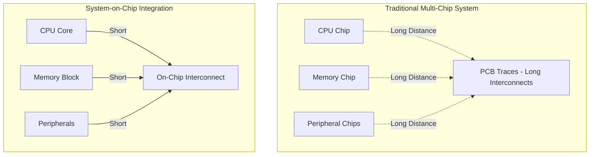

**Key Benefits:**

1. **Reduced Power Consumption**
   - Shorter interconnects mean lower capacitance
   - Reduced signal switching power
   - Integrated power management
   - Optimized voltage domains

2. **Smaller Form Factor**
   - Critical for mobile and embedded applications
   - Single package instead of multiple chips
   - Reduced PCB area requirements
   - Enables miniaturization

3. **Enhanced Performance**
   - Lower latency between components
   - Higher bandwidth internal buses
   - Reduced parasitic effects
   - Better signal integrity

4. **Cost Efficiency**
   - Reduced manufacturing complexity
   - Fewer components to assemble
   - Lower testing costs
   - Simplified supply chain

5. **Improved Reliability**
   - Fewer interconnection points
   - Reduced risk of connection failures
   - Better thermal management
   - Enhanced EMI characteristics

---

## 📜 Evolution of SoC Technology

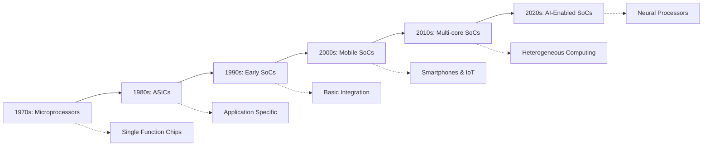

### Historical Milestones

**1970s - Birth of Microprocessors**
- Intel 4004, 8080 - discrete processors
- Separate memory and I/O chips required

**1980s - Application Specific Integration**
- ASICs emerge for dedicated applications
- Integration of logic functions

**1990s - True SoC Era Begins**
- ARM7 based SoCs for embedded systems
- Integration of CPU, memory controller, peripherals

**2000s - Mobile Revolution**
- Qualcomm Snapdragon, Apple A-series
- Power efficiency becomes paramount
- 3G/4G modem integration

**2010s - Multi-Core and Heterogeneous Computing**
- Big.LITTLE architectures
- GPU integration (Mali, Adreno)
- Advanced process nodes (28nm → 7nm)

**2020s - AI and Specialized Accelerators**
- Neural Processing Units (NPUs)
- Tensor accelerators
- 5G integration
- 5nm and below process technologies

---

## 🏗️ Core Components of a Typical SoC


---

## 🔬 SoC Architecture Deep Dive

### 1. Central Processing Unit (CPU)

The CPU serves as the computational engine of the SoC, executing instructions and managing system operations.

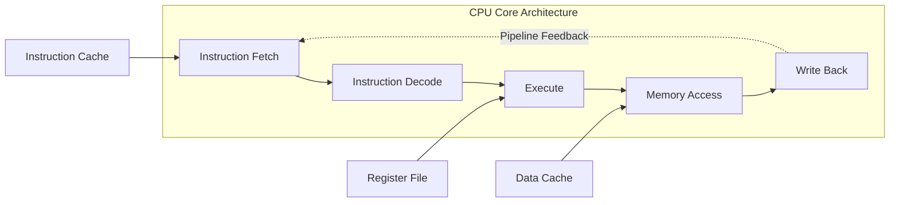

**CPU Components in BabySoC:**

- **Instruction Fetch Unit**
  - Fetches instructions from memory
  - Program counter management
  - Branch prediction (in advanced cores)

- **Decode Unit**
  - Interprets instruction opcodes
  - Generates control signals
  - Operand extraction

- **Execution Unit**
  - ALU (Arithmetic Logic Unit)
  - Shift and rotate operations
  - Comparison operations

- **Memory Access Unit**
  - Load/Store operations
  - Address calculation
  - Cache interface

- **Write-Back Unit**
  - Register file updates
  - Pipeline completion

**RISC-V Architecture Benefits:**
- Open-source ISA with no licensing fees
- Modular and extensible instruction sets
- Clean separation between user and privileged modes
- Growing ecosystem and tool support
- Excellent for educational purposes

---

### 2. Memory Subsystem

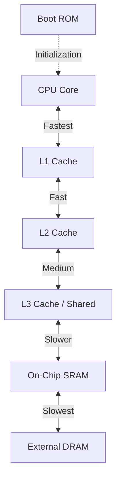

**Memory Hierarchy Explained:**

| Level | Type | Size | Speed | Purpose |
|-------|------|------|-------|---------|
| L1 Cache | SRAM | 16-64 KB | ~1 cycle | Instruction and data cache |
| L2 Cache | SRAM | 256KB-1MB | ~10 cycles | Unified cache per core |
| L3 Cache | SRAM | 2-32 MB | ~40 cycles | Shared across cores |
| On-chip SRAM | SRAM | 64KB-1MB | ~50 cycles | Scratchpad, buffers |
| Boot ROM | Mask ROM | 16-128 KB | ~50 cycles | Bootloader code |
| External DRAM | DRAM | 1-16 GB | ~100+ cycles | Main system memory |

**Cache Organization:**

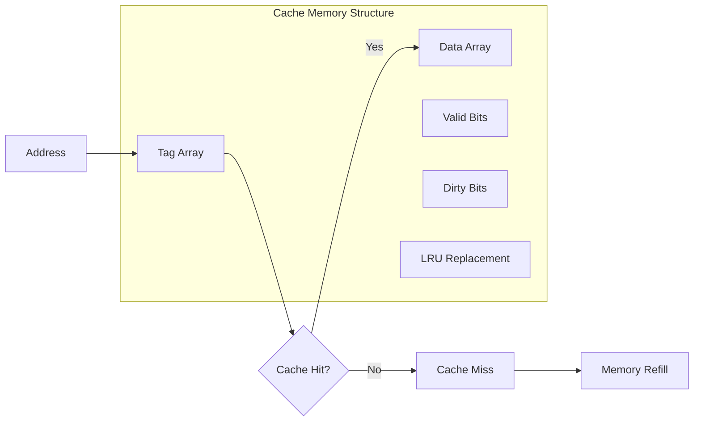

---

### 3. Peripheral Interfaces

Peripherals enable the SoC to interact with the external world through standardized protocols.

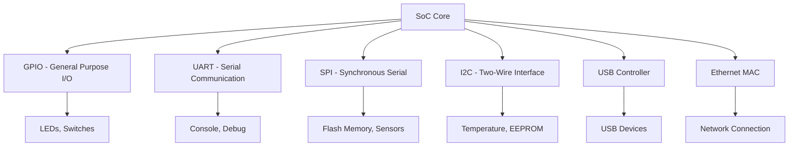

**Peripheral Details:**

**GPIO (General Purpose Input/Output)**
- Configurable as input or output
- Pull-up/pull-down resistors
- Interrupt capability
- Typical use: buttons, LEDs, control signals

**UART (Universal Asynchronous Receiver/Transmitter)**
- Asynchronous serial communication
- Configurable baud rates (9600 to 115200+)
- Start/stop bits for framing
- Common use: debugging, console interface

**SPI (Serial Peripheral Interface)**
- Synchronous serial communication
- Master-slave architecture
- High-speed data transfer (MHz range)
- Use: external memory, displays, sensors

**I2C (Inter-Integrated Circuit)**
- Two-wire protocol (SCL, SDA)
- Multi-master, multi-slave support
- Address-based device selection
- Use: sensor networks, EEPROMs

---

### 4. Interconnect Fabric

The interconnect serves as the communication backbone, enabling efficient data transfer between all components.

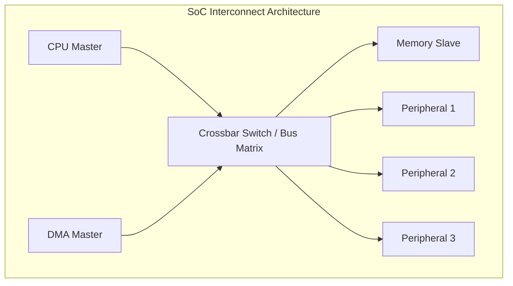

**Common Interconnect Protocols:**

| Protocol | Type | Width | Features |
|----------|------|-------|----------|
| AHB (AMBA) | Bus | 32/64-bit | Pipelined, burst transfers |
| AXI (AMBA) | Bus | 32/64/128-bit | Outstanding transactions, high performance |
| APB (AMBA) | Bus | 32-bit | Low power, simple peripherals |
| Wishbone | Bus | 8/16/32/64-bit | Open-source, flexible |
| TileLink | NoC | Variable | RISC-V ecosystem standard |

**Interconnect Features:**

- **Arbitration**: Resolves conflicts when multiple masters access same slave
- **Address Decoding**: Routes transactions to correct slave
- **Data Width Conversion**: Handles different bus widths
- **Clock Domain Crossing**: Bridges different clock frequencies
- **Quality of Service**: Prioritizes critical transactions

---

### 5. Power Management

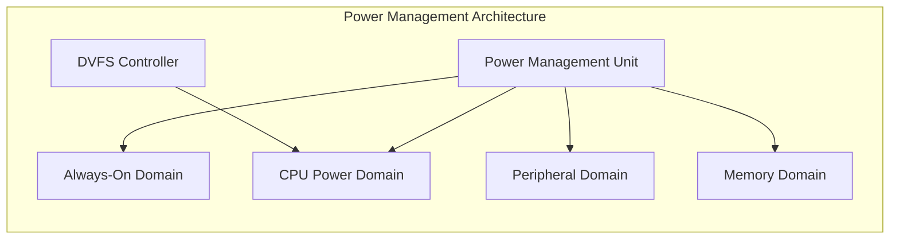

**Power Management Techniques:**

1. **Clock Gating**
   - Disables clocks to inactive modules
   - Reduces dynamic power consumption
   - Fine-grained control

2. **Power Gating**
   - Completely shuts down power domains
   - Eliminates leakage power
   - Requires state retention

3. **Dynamic Voltage and Frequency Scaling (DVFS)**
   - Adjusts voltage and frequency based on workload
   - Balances performance and power
   - Software-controlled

4. **Multiple Power Domains**
   - Independent voltage islands
   - Allows selective shutdown
   - Requires isolation cells

---

### 6. Clock Distribution Network

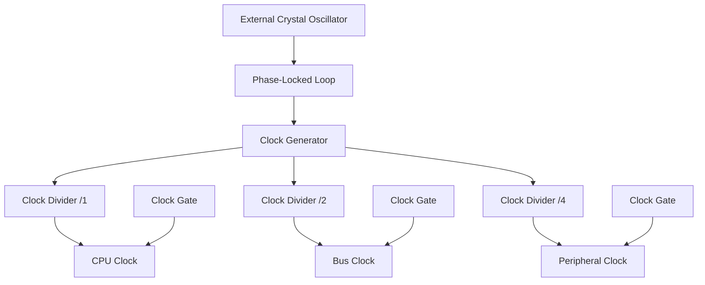

**Clock Management:**

- **PLL (Phase-Locked Loop)**: Multiplies reference frequency
- **Clock Dividers**: Generate lower frequency clocks
- **Clock Gating**: Conditional clock enable
- **Clock Tree**: Balanced distribution network
- **Skew Management**: Minimizes timing variations

---

## 🎯 Understanding BabySoC

BabySoC is designed as an educational platform to introduce learners to SoC design concepts without the overwhelming complexity of commercial-grade systems.

### BabySoC Architecture Overview

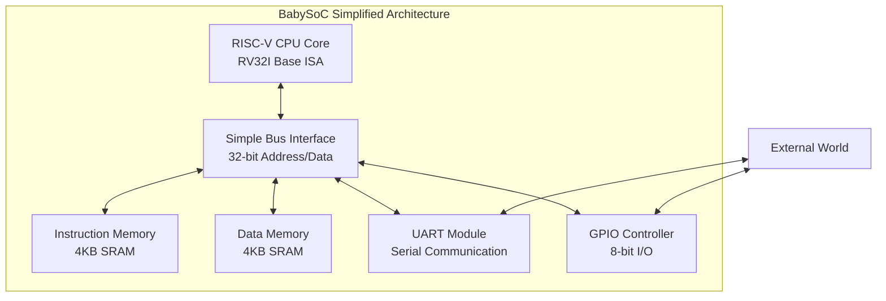

### Why BabySoC? Educational Benefits

**1. Manageable Complexity**
- Focus on core SoC concepts
- Simplified components for easier understanding
- Clear module boundaries
- Reduced simulation time

**2. Open-Source Tools**
- Icarus Verilog for simulation
- GTKWave for waveform analysis
- No expensive EDA licenses required
- Accessible to all students

**3. Modular Architecture**
- Clear separation of concerns
- Easy to modify and extend
- Supports incremental learning
- Facilitates debugging

**4. Hands-On Learning**
- Practical experience with real design flows
- From RTL to simulation to synthesis
- Understanding tool chains
- Building design intuition

### BabySoC vs Commercial SoC

| Feature | BabySoC | Commercial SoC |
|---------|---------|----------------|
| CPU Cores | 1 RISC-V core | 4-8 ARM/x86 cores |
| Memory | 8 KB total | GB of DRAM |
| Peripherals | UART, GPIO | USB, WiFi, GPU, Camera |
| Cache | None or simple | Multi-level hierarchy |
| Power Management | Basic | Advanced DVFS, domains |
| Purpose | Education | Production devices |
| Complexity | ~1K lines RTL | Millions of gates |

---

## 🔄 SoC Design Flow: From Concept to Silicon

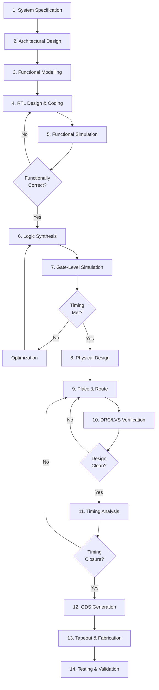

### Detailed Design Stages

**Stage 1: System Specification**
- Define requirements and constraints
- Performance targets (clock frequency, throughput)
- Power budget
- Interface specifications
- Memory requirements

**Stage 2: Architectural Design**
- High-level block diagram
- Component selection
- Interconnect topology
- Memory hierarchy planning
- Partition strategy

**Stage 3: Functional Modelling (Week 2 Focus)**
- Behavioral description in C/C++/SystemC or Verilog
- Algorithm verification
- Performance estimation
- Interface validation
- Creates golden reference

**Stage 4: RTL Design**
- Hardware Description Language coding (Verilog/VHDL)
- Synthesizable code
- Module implementation
- State machines and control logic

**Stage 5: Functional Simulation**
- Testbench development
- Functional verification
- Corner case testing
- Coverage analysis

**Stage 6: Logic Synthesis**
- Convert RTL to gate-level netlist
- Technology mapping
- Area/timing optimization
- Power optimization

**Stage 7: Gate-Level Simulation**
- Verify synthesized netlist
- Timing simulation
- Power estimation
- Equivalence checking

**Stage 8-10: Physical Design**
- Floorplanning
- Placement
- Clock tree synthesis
- Routing
- Extraction

**Stage 11: Timing Analysis**
- Static timing analysis (STA)
- Setup/hold time verification
- Clock domain crossing checks
- Signal integrity analysis

**Stage 12-13: Tapeout**
- GDSII file generation
- Final checks
- Send to foundry
- Mask preparation

**Stage 14: Post-Silicon**
- Device testing
- Characterization
- Debug and fixes
- Production qualification

---

## 🧪 Functional Modelling: The First Critical Step

Functional modelling occurs early in the design flow and serves to validate the system architecture before committing to RTL implementation.

### Why Functional Modelling Comes First

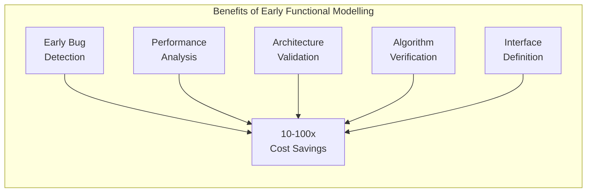

**1. Early Bug Detection**
- Architectural flaws caught before RTL coding
- Cheaper to fix than post-synthesis bugs
- 10-100x cost reduction
- Faster iteration cycles

**2. Performance Estimation**
- Analyze throughput and latency
- Bandwidth requirements
- Resource utilization
- Bottleneck identification

**3. Interface Validation**
- Protocol compliance
- Handshaking mechanisms
- Data flow verification
- Timing relationships

**4. Algorithm Verification**
- Computational correctness
- Numerical accuracy
- Edge case handling
- Golden reference creation

**5. Documentation**
- Specification refinement
- Design decisions recorded
- Team communication
- Customer demonstrations

### Functional Modelling Abstraction Levels

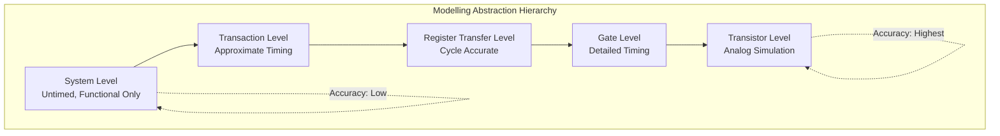

---

### Functional Modelling Process

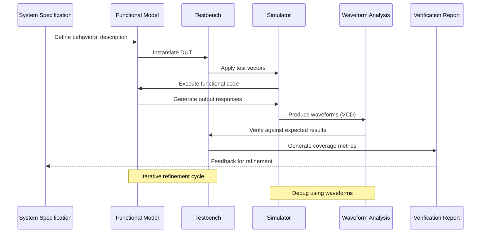

### BabySoC Functional Model Components

**CPU Behavioral Model**
```
- Instruction Fetch: Read from instruction memory
- Decode: Parse opcode and operands
- Execute: ALU operations, branch resolution
- Memory Access: Load/store operations
- Write-Back: Register file updates
```

**Memory Model**
```
- Read operation: address → data
- Write operation: address + data + write_enable
- Timing: Configurable latency
- Size: 4KB instruction + 4KB data
```

**Peripheral Models**
```
UART:
- Transmit shift register
- Receive shift register
- Baud rate generator
- Status/control registers

GPIO:
- Direction register (input/output)
- Data register
- Pull-up/down configuration
```

**Interconnect Abstraction**
```
- Address decoding
- Read/write arbitration
- Data routing
- Response generation
```

---

## 🔍 Simulation and Verification Workflow

### Verification Strategy

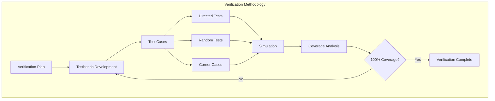

### Testbench Architecture

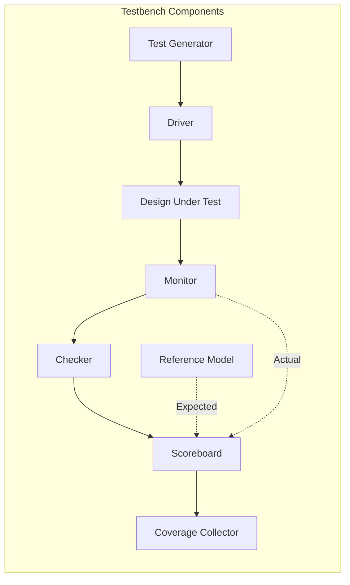

**Testbench Components:**

1. **Test Generator**
   - Creates test stimuli
   - Random/directed patterns
   - Constrained randomization

2. **Driver**
   - Applies inputs to DUT
   - Protocol compliance
   - Timing control

3. **Monitor**
   - Observes DUT outputs
   - Captures transactions
   - Non-intrusive observation

4. **Checker**
   - Compares actual vs expected
   - Protocol checking
   - Error reporting

5. **Scoreboard**
   - Transaction tracking
   - Out-of-order checking
   - Statistics gathering

6. **Coverage Collector**
   - Functional coverage
   - Code coverage
   - Assertion coverage

### Simulation Flow with Icarus Verilog

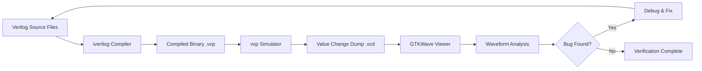

### Waveform Analysis

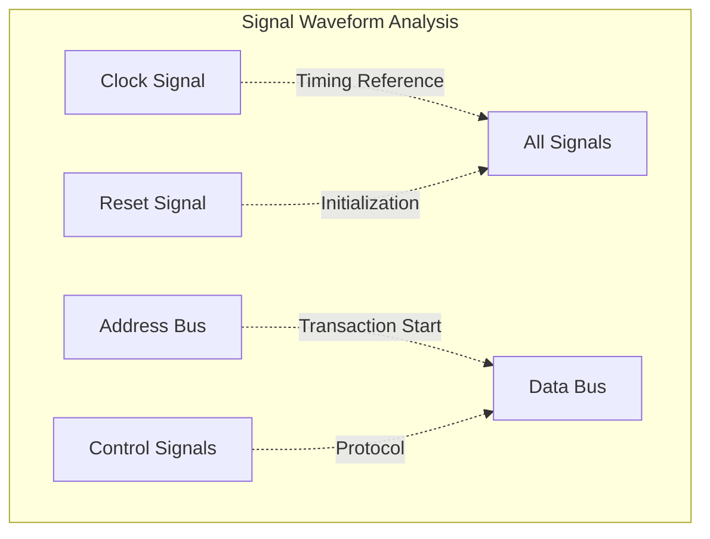

**Key Analysis Points:**

- **Clock Alignment**: All signals synchronized to clock
- **Reset Behavior**: Proper initialization
- **Setup/Hold Times**: Signal stability
- **Protocol Compliance**: Handshaking correct
- **Data Integrity**: Correct values propagated

---

## 🛠️ Tools and Environment

### Simulation Toolchain

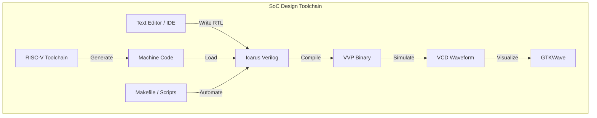

### Tool Details

| Tool | Purpose | Features | Installation |
|------|---------|----------|--------------|
| **Icarus Verilog** | HDL simulator | IEEE-1364 compliant, fast, open-source | `apt-get install iverilog` |
| **GTKWave** | Waveform viewer | VCD/FST support, signal searching, measuring | `apt-get install gtkwave` |
| **RISC-V GNU Toolchain** | Cross-compiler | GCC, binutils, GDB for RISC-V | Build from source or use prebuilt |
| **VS Code / Vim** | Code editor | Syntax highlighting, plugins | Standard installation |
| **Make** | Build automation | Dependency management, script execution | Pre-installed on Linux |

### Icarus Verilog (iverilog)

**Capabilities:**
- Verilog-2005 standard support
- SystemVerilog partial support
- Fast compilation and simulation
- VCD/LXT waveform generation
- Command-line driven

**Typical Usage:**
```bash
# Basic simulation
iverilog -o output.v
```
## 🚀 BabySoC Implementation Details

### Module Hierarchy

```mermaid
graph TB
    TOP[babysoc_top.vTop-level Integration]
    
    TOP --> CORE[riscv_core.vRISC-V CPU]
    TOP --> IMEM[instruction_mem.v4KB SRAM]
    TOP --> DMEM[data_mem.v4KB SRAM]
    TOP --> UART[uart.vSerial Interface]
    TOP --> GPIO[gpio.vI/O Controller]
    TOP --> BUS[bus_interface.vInterconnect]
    
    CORE --> IF[fetch_stage.v]
    CORE --> ID[decode_stage.v]
    CORE --> EX[execute_stage.v]
    CORE --> MEM_STAGE[memory_stage.v]
    CORE --> WB[writeback_stage.v]
    CORE --> REGFILE[register_file.v]
    
    UART --> TX[uart_tx.v]
    UART --> RX[uart_rx.v]
    UART --> BAUD[baud_gen.v]
```

### Address Map

```mermaid
graph TB
    subgraph Address_Space["BabySoC Memory Map"]
        direction TB
        A1["0x0000_0000 - 0x0000_0FFFInstruction Memory (4KB)"]
        A2["0x0000_1000 - 0x0000_1FFFData Memory (4KB)"]
        A3["0x1000_0000 - 0x1000_000FUART Registers"]
        A4["0x1000_0010 - 0x1000_001FGPIO Registers"]
        A5["0xFFFF_FFF0 - 0xFFFF_FFFFSystem Control"]
    end
```

| Address Range | Module | Description |
|---------------|--------|-------------|
| 0x0000_0000 - 0x0000_0FFF | Instruction Memory | 4KB SRAM for program code |
| 0x0000_1000 - 0x0000_1FFF | Data Memory | 4KB SRAM for variables |
| 0x1000_0000 | UART_DATA | UART transmit/receive data |
| 0x1000_0004 | UART_STATUS | UART status register |
| 0x1000_0008 | UART_CONTROL | UART control register |
| 0x1000_0010 | GPIO_DATA | GPIO data register |
| 0x1000_0014 | GPIO_DIR | GPIO direction (I/O) |
| 0xFFFF_FFFC | SYSTEM_STATUS | System status flags |

### Signal Interface Specifications

**CPU to Bus Interface:**
```
Outputs:
  - addr[31:0]      : Address bus
  - wdata[31:0]     : Write data
  - wr_en           : Write enable
  - rd_en           : Read enable
  - byte_en[3:0]    : Byte enable

Inputs:
  - rdata[31:0]     : Read data
  - ready           : Transaction complete
  - error           : Bus error flag
```

**Bus to Memory Interface:**
```
Inputs:
  - addr[11:0]      : Address (4KB space)
  - wdata[31:0]     : Write data
  - wr_en           : Write enable
  - rd_en           : Read enable

Outputs:
  - rdata[31:0]     : Read data
  - ready           : Access complete
```

**Bus to UART Interface:**
```
Control Registers:
  - UART_DATA[7:0]      : TX/RX data buffer
  - UART_STATUS[7:0]    : Status bits
    [0] : TX busy
    [1] : RX ready
    [2] : TX complete
    [3] : RX error
  - UART_CONTROL[7:0]   : Control bits
    [0] : Enable
    [1] : TX start
    [2] : RX enable
    [7:4] : Baud rate select
```

### Clock and Reset Strategy

```mermaid
graph LR
    subgraph Clock_Reset["Clock and Reset Distribution"]
        OSC[External Clock] --> CLK[System Clock]
        RST_PIN[Reset Button] --> SYNC[Reset Synchronizer]
        SYNC --> RST_N[Active-Low Reset]
        
        CLK --> CPU_CLK[CPU Clock]
        CLK --> BUS_CLK[Bus Clock]
        CLK --> PER_CLK[Peripheral Clock]
        
        RST_N --> CPU_RST[CPU Reset]
        RST_N --> BUS_RST[Bus Reset]
        RST_N --> PER_RST[Peripheral Reset]
    end
```

**Reset Sequence:**
1. Assert reset (active low)
2. Hold for minimum 10 clock cycles
3. Release reset on clock edge
4. CPU begins fetching from address 0x0000_0000
5. Peripherals initialize to default state

---

## 🧬 Data Flow and Transaction Examples

### CPU Read Transaction

```mermaid
sequenceDiagram
    participant CPU as CPU Core
    participant BUS as Bus Interface
    participant MEM as Memory
    
    Note over CPU: Need data from 0x1000
    CPU->>BUS: addr=0x1000, rd_en=1
    BUS->>MEM: Decode address, forward request
    Note over MEM: Access memory array
    MEM->>BUS: rdata=0xDEADBEEF, ready=1
    BUS->>CPU: Return data
    Note over CPU: Data received, continue execution
```

### CPU Write Transaction

```mermaid
sequenceDiagram
    participant CPU as CPU Core
    participant BUS as Bus Interface
    participant MEM as Memory
    
    Note over CPU: Write 0x12345678 to 0x1004
    CPU->>BUS: addr=0x1004, wdata=0x12345678, wr_en=1
    BUS->>MEM: Decode address, forward request
    Note over MEM: Write to memory array
    MEM->>BUS: ready=1, write complete
    BUS->>CPU: Acknowledge
    Note over CPU: Continue execution
```

### UART Transmission Flow

```mermaid
sequenceDiagram
    participant CPU as CPU Core
    participant UART as UART Module
    participant PIN as TX Pin
    
    CPU->>UART: Write 'A' (0x41) to UART_DATA
    Note over UART: Load shift register
    UART->>CPU: Set TX_BUSY flag
    
    Note over UART: Start bit
    UART->>PIN: Output 0 (start)
    
    loop 8 data bits
        UART->>PIN: Output bit[i]
    end
    
    Note over UART: Stop bit
    UART->>PIN: Output 1 (stop)
    
    UART->>CPU: Clear TX_BUSY, set TX_COMPLETE
    Note over CPU: Ready for next byte
```

---

## 🎓 Key Learnings & Understanding

### Fundamental Insights

Through this week's study of SoC fundamentals and functional modelling, several critical concepts emerged:

#### 1. Hierarchical Design Philosophy

SoC design is inherently hierarchical. Each component (CPU, memory, peripherals) is designed independently with well-defined interfaces, then integrated through a standardized interconnect. This modularity enables:

- **Parallel Development**: Teams work on different modules simultaneously
- **Simplified Debugging**: Issues isolated to specific modules
- **Reusability**: Proven IP blocks used across projects
- **Maintainability**: Changes localized to affected modules

```mermaid
graph TB
    subgraph Hierarchy["Design Hierarchy Benefits"]
        TOP[Top Level Integration]
        TOP --> M1[Module 1Independent Design]
        TOP --> M2[Module 2Independent Design]
        TOP --> M3[Module 3Independent Design]
        
        M1 --> T1[Testbench 1]
        M2 --> T2[Testbench 2]
        M3 --> T3[Testbench 3]
        
        T1 -.Individual Verification.-> M1
        T2 -.Individual Verification.-> M2
        T3 -.Individual Verification.-> M3
        
        INT[Integration Testing] --> TOP
    end
```

#### 2. Abstraction Layers

The design process moves through multiple abstraction levels, each refining the previous while maintaining functional equivalence:

**System Level (Highest Abstraction)**
- Pure functionality, no timing
- Algorithm correctness
- Fast simulation (seconds)

**Transaction Level (TLM)**
- Approximate timing
- Communication modeling
- Medium simulation speed (minutes)

**Register Transfer Level (RTL)**
- Cycle-accurate behavior
- Synthesizable code
- Moderate simulation speed (hours)

**Gate Level**
- Logic gates and flip-flops
- Accurate timing
- Slow simulation (days)

**Transistor Level (Lowest Abstraction)**
- SPICE simulation
- Analog behavior
- Very slow simulation (weeks)

#### 3. Verification-First Mindset

Modern SoC design adopts a "shift-left" verification approach:

```mermaid
graph LR
    A[Specification] --> B[Verification Plan]
    B --> C[Functional Model]
    C --> D[Testbench]
    D --> E[RTL Design]
    E --> F[Continuous Verification]
    
    F -.Feedback.-> E
    F -.Feedback.-> C
    
```

**Benefits:**
- Bugs caught early are 10-100x cheaper to fix
- Comprehensive test suites prevent regression
- Functional model serves as golden reference
- Coverage metrics guide verification effort

#### 4. Interface Standardization

Modern SoCs rely on standardized interfaces to ensure component reusability:

**AMBA (Advanced Microcontroller Bus Architecture)**
- AHB: High-performance system bus
- AXI: Advanced eXtensible Interface
- APB: Low-power peripheral bus

**Open Standards**
- Wishbone: Open-source bus
- TileLink: RISC-V ecosystem
- OCP: Open Core Protocol

**Benefits of Standards:**
- Plug-and-play IP integration
- Verified compliance
- Tool support
- Industry acceptance

#### 5. Power-Performance-Area Trade-offs

Every design decision involves trade-offs:

```mermaid
graph TB
    subgraph PPA["The PPA Triangle"]
        PERF[Performance]
        PWR[Power]
        AREA[Area]
        
        PERF -.Conflict.-> PWR
        PWR -.Conflict.-> AREA
        AREA -.Conflict.-> PERF
    end
    
    subgraph Examples["Design Choices"]
        E1["Higher frequency→ More power"]
        E2["Larger cache→ Better performance→ More area"]
        E3["Pipeline depth→ Higher frequency→ More power"]
    end
```

#### 6. Timing and Synchronization

Understanding clock domains and synchronization is critical:

**Single Clock Domain**
- Simpler design
- No synchronization issues
- Limited to slowest component

**Multiple Clock Domains**
- Optimized performance
- Reduced power consumption
- Requires careful synchronization

**Clock Domain Crossing (CDC)**
- Two-flop synchronizers
- Handshaking protocols
- FIFO buffers
- Metastability consideration

---

## 📌 Summary

This week established the foundational understanding necessary for SoC design through comprehensive exploration of:

### Core Concepts Mastered

**1. SoC Architecture**
- Integration of CPU, memory, peripherals, and interconnect on a single chip
- Understanding of component roles and interactions
- Memory hierarchy and address mapping
- Peripheral interfacing and control

**2. Design Methodology**
- Functional modelling precedes RTL to validate architecture early
- Hierarchical design enables modularity and reusability
- Verification-first mindset reduces overall project risk
- Iterative refinement through simulation and analysis

**3. Simulation and Verification**
- Icarus Verilog compilation and simulation flow
- GTKWave waveform analysis techniques
- Testbench development strategies
- Coverage metrics and verification planning

**4. BabySoC Implementation**
- RISC-V CPU core architecture
- Memory subsystem organization
- Peripheral modules (UART, GPIO)
- Bus interface and address decoding

**5. Workflow**
- Open-source EDA tool usage
- Command-line simulation flow
- Waveform debugging techniques
- Build automation with Makefiles

## Tools & Technologies

| Category | Tool/Technology |
|----------|----------------|
| **HDL Simulation** | Icarus Verilog 11.0+ |
| **Waveform Viewer** | GTKWave 3.3.100+ |
| **Processor ISA** | RISC-V RV32I |
| **Text Editor** | VS Code / Vim |
| **Documentation** | Markdown, Mermaid |
| **Version Control** | Git / GitHub |

---

### Learning Resources

- [VSD SoC Journey - GitHub](https://github.com/hemanthkumardm/SFAL-VSD-SoC-Journey/tree/main/12.%20VSDBabySoC%20Project)
- [RISC-V ISA Specifications](https://riscv.org/technical/specifications/)
- [Icarus Verilog Documentation](http://iverilog.icarus.com/)
- [GTKWave User Guide](http://gtkwave.sourceforge.net/)
- [AMBA Protocol Specifications](https://www.arm.com/architecture/system-architectures/amba)

---
