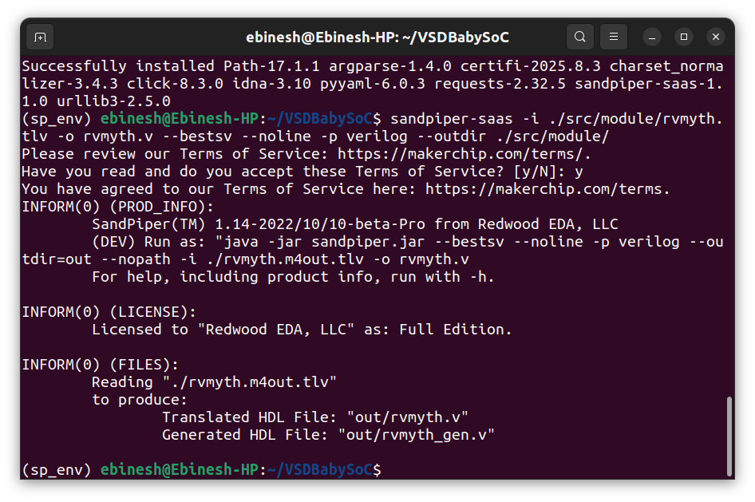
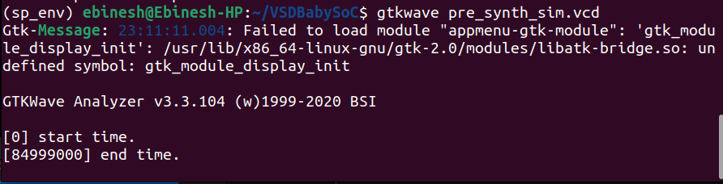

# Week 2: Part 2 – Practical Implementation & Functional Simulation

## 🎯 Objective

This section focuses on **building and validating** the BabySoC design through simulation of its core components—the RISC-V processor, Phase-Locked Loop (PLL), and Digital-to-Analog Converter (DAC)—leveraging **Icarus Verilog**, **GTKWave**, and **Yosys** toolchains.
The primary goal is to confirm correct logical behavior of the System-on-Chip before proceeding to the physical implementation phase.

---

## Step 1 – Repository Setup

Begin by obtaining the BabySoC design files from the official repository and accessing the project directory:

```bash
git clone https://github.com/manili/VSDBabySoC.git
cd VSDBabySoC/
ls
```

Upon listing the contents, you should observe essential directories including `src/`, `output/`, along with a `Makefile` for build automation.


---

## 🧱 Step 2 – Explore Source Modules

Examine the available hardware description modules within the source tree:

```bash
ls src/
ls src/module/
```

The BabySoC design comprises several fundamental RTL components:

| File           | Description                                     |
| -------------- | ----------------------------------------------- |
| `rvmyth.tlv`   | RISC-V processor core written in TL-Verilog format. |
| `avsddac.v`    | 10-bit Digital-to-Analog Converter for signal generation. |
| `avsdpll.v`    | Phase-Locked Loop circuit for clock synthesis. |
| `clk_gate.v`   | Clock gating logic for power optimization. |
| `vsdbabysoc.v` | System-level wrapper integrating CPU, PLL, and DAC. |
| `testbench.v`  | Verification environment for functional testing. |


---

## 🧠 Step 3 – Set Up Python Environment & SandPiper SaaS

The RISC-V processor module (`rvmyth.tlv`) is initially written in Transaction-Level Verilog (TL-Verilog), which requires translation to synthesizable Verilog.

```bash
python3 -m venv sp_env
source sp_env/bin/activate
pip install pyyaml click sandpiper-saas
sandpiper-saas -i ./src/module/rvmyth.tlv -o rvmyth.v --bestsv --noline -p verilog --outdir ./src/module/
```


This translation process generates the standard Verilog file `rvmyth.v` within the `src/module/` path.



---

## ▶️ Step 4 – Pre-Synthesis Simulation

Establish an output workspace and perform compilation of all design modules for **behavioral-level simulation**:

```bash
mkdir -p output/pre_synth_sim
iverilog -o output/pre_synth_sim/pre_synth_sim.out -DPRE_SYNTH_SIM \
-I src/include -I src/module \
src/module/testbench.v
vvp output/pre_synth_sim/pre_synth_sim.out
```


The simulation run produces a value change dump file named `pre_synth_sim.vcd`, which captures all signal transitions during execution.

Launch the waveform viewer to inspect simulation results:

```bash
gtkwave pre_synth_sim.vcd
```



---

## 📊 Step 5 – Analyze Pre-Synthesis Waveform

**Key Signal Observations:**

| Signal        | Purpose              | Expected Behavior                        |
| ------------- | --------------------- | ---------------------------------------- |
| `reset`       | System initialization | Begins high, transitions to low after startup |
| `ENb_VCO`     | PLL activation control | Transitions low to enable voltage-controlled oscillator |
| `REF`         | Reference clock input | Exhibits stable, periodic square wave |
| `VCO_IN`      | PLL feedback signal | Demonstrates phase alignment with REF |
| `OUT`         | DAC analog output | Displays smooth waveform corresponding to digital input |
| `VREFH/VREFL` | DAC voltage references | Maintains constant levels at 3.3V and 0V respectively |

The DAC output signal (`OUT`) successfully demonstrates the anticipated analog waveform pattern that correlates with the digital values produced by the RISC-V processor core.


---


## Conclusion

This marks the completion of the **functional modeling phase** of the BabySoC project for **Week 2** of the RISC-V SoC Tapeout Journey.

In this phase, we:

- Generated the Verilog code from TLV, and  
- Verified the logical functionality through pre-synthesis simulation.
